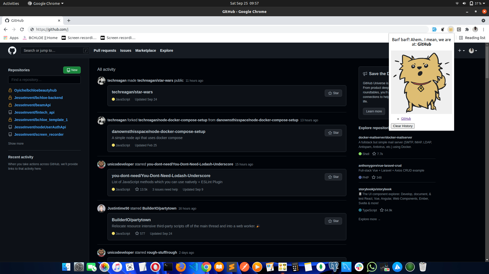

# Acho Chrome extension

Acho is a chrome extension that 'barks' the name of the page loaded at your current tab.
It also stores all tabs you've visited and displays them to you. 

I built it following a Blog post on Building chrome extensions from [Paula Santamaria](https://dev.to/paulasantamaria) on [Dev.to](https://dev.to)

[Click to View Blog Post](https://dev.to/paulasantamaria/creating-a-simple-chrome-extension-36m)

# Learning is Fun !! 😃😃